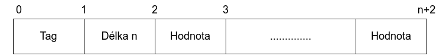
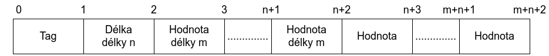

# ISA projekt - LDAP server

## Teorie
LDAP (Lightweight Directory Access Protocol) slouží pro ukládání a přístup k datům na adresářovém serveru (uložena ve formě stromu). Pro kódování zpráv je použit BER. Pro přenos zpráv využívá TCP.

### BER (Basic Encoding Rules)
Zpráva kódovaná pomocí BER (patří k TLV formátům) se skládá ze tří částí:
* Type - identifikátor typu
* Length - informace o délce zprávy
* Value - hodnota (může obsahovat další BER)

#### Type
Má velkost jednoho bajtu a obsahuje informaci o typu hodnoty.
* 0-4 bit - číslo tagu
* 5 bit - zda je hodnota primitive (0), či constructed (1)
* 6-7 bit - třída (univerzální, definováno aplikací, kontextově závislé a privátní)

#### Length
Dělí se na krátkou a dlouhou formu. Krátká forma (nejvíce významný bit je 0) se používá pro hodnoty, jejichž délka se dá vyjádřit pomocí 7 bitů (tedy 0 až 255 bajtů).  
  
Dlouhá forma (nejvíce významný bit je 1) se používá pro hodnoty, jejichž délka se nedá vyjádřit pomocí 7 bitů. V tomto případě těchto 7 bitů obsahuje počet následujících bajtů, které obsahují délku hodnoty.


#### Value
Obsahuje hodnotu rozdělenou na jednotlivé bajty, nebo může obsahovat další vnořené TLV.

### Průběh LDAP komunikace
Nejdříve klient musí navázat spojení s LDAP serverem pomocí zprávy **Bind Request**, na kterou server odpoví zprávou **Bind Response**. Následně server očekává příkazy od klienta. V našem server reaguje pouze na zprávy typu **Search request**, na které server odpovídá výsledky vyhledávání pomocí zpráv **Search Result Entry** (každý výsledek vyhledávání je jedna zpráva) a po odeslání všech výsledků (nebo dosažení nastaveného limitu počtu výsledků) server zašle zprávu **Search Result Done**, kterou potvrdí konec vyhledávání. Dále server čeká na další **Search Request** nebo **Unbind Request**, jenž klient ukončí komunikaci se serverem.

### Struktura LDAP zprávy
```
SEQUENCE {
    message ID       INTEGER
    protocol data    CHOICE{
        Bind Request,
        Bind Response,
        Unbind Request,
        Search Request,
        Search Result Entry,
        Search Result Done,
        ...
    }
}
```

### Zpráva Bind Request
```
[APPLICATION 0] SEQUENCE{
    protocol version   INTEGER
    name               STRING
    authentication     INTEGER
}
```

### Zpráva Bind Response
```
[APPLICATION 1] SEQUENCE{
    result code         INTEGER
    matchedDN           STRING
    error message       STRING
}
```

### Zpráva Unbind Request
```
[APPLICATION 2] NULL
```

### Zpráva Search Request
```
[APPLICATION 3] SEQUENCE{
    base object     STRING
    scope           ENUMERATED(baseObject, singleLevel, wholeSubtree)
    derefAlias      ENUMERATED(neverDerefAliases, ...)
    sizeLimit       INTEGER
    timeLimit       INTEGER
    typesOnly       BOOLEAN
    filter          FILTER
    attributes      ATTRIBUTE_SELECTION(SEQUENCE of string)
}
```
#### Filtr
```
CHOICE {
    and             0
    or              1
    not             2
    equalityMatch   3
    substrings      4
    ...
}
```
#### Filtr podřetězce
```
SEQUENCE{
    type        STRING
    substrings  SEQUENCE {
        initial     0   occur max once
        any         1   
        final       2   occur max once
    }
}
```

### Zpráva Search Result Entry
```
[APPLICATION 4] SEQUENCE{
    object name      STRING
    attributes       SEQUENCE {
        attribute       SEQUENCE {
            column          STRING
            value           STRING
        }
    }
}
```

### Zpráva Search Result Done
```
[APPLICATION 5] SEQUENCE{
    result code         INTEGER
    matchedDN           STRING
    error message       STRING
}
```

## Implementace
Aplikace je rozdělena do několika částí:
* třída **ArgParse**
* třída **LdapServer**
* třída **BER**
* třída **Database**
* soubor **error.cpp a error.hpp**
* soubor **filter.hpp**

### Třída **ArgParse**
Obsahuje několik veřejných metod:
* void parse(int argc, char *argv[])
  * zpracuje argumenty příkazové řádky
* int getPortNumber()
  * vrátí číslo portu získané z argumentů
* string getFileName()
  * vrátí název souboru s daty získané z argumentů

### Třída **LdapServer**
Třída starající se o funkci serveru. Pro spuštění serveru obsahuje veřejnou metodu `void start()`, která server spustí a následně řídí i komunikaci s klientem. Dále obsahuje metody `int getParentFD()` a `int getChildFD()`, které jsou využity pro uzavření soketů při příjmu SIGINT signálu.

### Třída **BER**
Stará se o kódování a dekódování zpráv. Pro dekódování zprávy přijaté od klienta obsahuje veřejnou metodu `int decode(vector<char> message, ldap_msg_t &resultMessage)` a pro kódování zpráv určené odeslání klientovi obsahuje metodu `int encode(vector<char> &resultMessage, ldap_msg_t &message)`.

#### Dekódování filtrů
Dekódovaná data filtru se ukládají do stromové struktury, kde každý uzel obsahuje:
* typ filtru
* seznam potomků (pouze u filtrů AND, OR a NOT)
* seznam dat (pouze u filtrů pro řetězce)
Listový uzel je vždy filtr řetězce.

### Třída **Database**
Načte data ze souboru při vytvoření instance. obsahuje metodu `record_t search(filter_t &filter)`, která slouží pro vyhledávání v databázi podle zadaného filtru a vrátí první záznam odpovídající filtru (ukládá si pozici posledního záznamu a při dalším hledání pokračuje od této pozice). Dále obsahuje metodu `void resetDbPosition()`, která nastaví aktuální pozici na začátek databáze (0).  

### Soubor **error.cpp a error.hpp**
Obsahuje chybové návratové kódy a funkci pro výpis chybové hlášky podle chybového kódu.

### Soubor **filter.hpp**
Obsahuje struktury pro filtr.

## Testování
Testování probíhalo ručně. Server byl spuštěn pomocí příkazu:
> sudo ./isa-ldapserver -f testFiles/ldapDB.csv

### Testovací případy

#### Výpis všech záznamů pomocí IPv4
> ldapsearch -x -H ldap://127.0.0.1

Výsledkem byly všechny záznamy z databáze.

#### Výpis všech záznamů pomocí IPv6
> ldapsearch -x -H ldap://[::1]

Výsledkem byly všechny záznamy z databáze

#### Porovnávání řetězců
> ldapsearch -x -H ldap://127.0.0.1 "(cn=Zatecka Michal)"

Výsledek:
```
# xzatec02
dn: uid=xzatec02
cn: Zatecka Michal
mail: xzatec02@stud.fit.vutbr.cz
```

#### Jednoduché substring filtry
> ldapsearch -x -H ldap://127.0.0.1 "(uid=xzate*)"

Výsledek:
```
# xzatec02
dn: uid=xzatec02
cn: Zatecka Michal
mail: xzatec02@stud.fit.vutbr.cz
```
> ldapsearch -x -H ldap://127.0.0.1 "(uid=\*zatec\*)"

Výsledek:
```
# xzatec02
dn: uid=xzatec02
cn: Zatecka Michal
mail: xzatec02@stud.fit.vutbr.cz
```

> ldapsearch -x -H ldap://127.0.0.1 "(uid=*c02)"

Výsledek:
```
# xkotuc02
dn: uid=xkotuc02
cn: Kotuc Branislav
mail: xkotuc02@stud.fit.vutbr.cz

# xzatec02
dn: uid=xzatec02
cn: Zatecka Michal
mail: xzatec02@stud.fit.vutbr.cz
```

#### Kombinace substring filtrů
> ldapsearch -x -H ldap://127.0.0.1 "(uid=xza*c02)"

Výsledek:
```
# xzatec02
dn: uid=xzatec02
cn: Zatecka Michal
mail: xzatec02@stud.fit.vutbr.cz
```

> ldapsearch -x -H ldap://127.0.0.1 "(uid=\*at\*c02)"

Výsledek:
```
# xzatec02
dn: uid=xzatec02
cn: Zatecka Michal
mail: xzatec02@stud.fit.vutbr.cz
```

> ldapsearch -x -H ldap://127.0.0.1 "(cn=\*ka\*Mich\*)"

Výsledek:
```
# xbukas00
dn: uid=xbukas00
cn: Bukas Jozef Michal
mail: xbukas00@stud.fit.vutbr.cz

# xkabel02
dn: uid=xkabel02
cn: Kabelka Michal
mail: xkabel02@stud.fit.vutbr.cz

# xkubec04
dn: uid=xkubec04
cn: Kubecka Michal
mail: xkubec04@stud.fit.vutbr.cz

# xondre15
dn: uid=xondre15
cn: Ondrejka Michal
mail: xondre15@stud.fit.vutbr.cz

# xpoliv07
dn: uid=xpoliv07
cn: Polivka Michael
mail: xpoliv07@stud.fit.vutbr.cz

# xzatec02
dn: uid=xzatec02
cn: Zatecka Michal
mail: xzatec02@stud.fit.vutbr.cz
```

#### Filtry s AND, OR a NOT

> ldapsearch -x -H ldap://127.0.0.1 "(&(cn=\*Zatecka\*)(cn=\*Michal\*))"

Výsledek:
```
# xzatec02
dn: uid=xzatec02
cn: Zatecka Michal
mail: xzatec02@stud.fit.vutbr.cz
```

> ldapsearch -x -H ldap://127.0.0.1 "(|(cn=\*tecka\*)(uid=\*ec0\*))"

Výsledek:
```
# xberec00
dn: uid=xberec00
cn: Berecz Tomas
mail: xberec00@stud.fit.vutbr.cz

# xkanec01
dn: uid=xkanec01
cn: Kanecka Ondrej
mail: xkanec01@stud.fit.vutbr.cz

# xkubec03
dn: uid=xkubec03
cn: Kubec Viktor
mail: xkubec03@stud.fit.vutbr.cz

# xkubec04
dn: uid=xkubec04
cn: Kubecka Michal
mail: xkubec04@stud.fit.vutbr.cz

# xmarec07
dn: uid=xmarec07
cn: Marecek Ales
mail: xmarec07@stud.fit.vutbr.cz

# xponec01
dn: uid=xponec01
cn: Ponechal Adrian
mail: xponec01@stud.fit.vutbr.cz

# xskrec00
dn: uid=xskrec00
cn: Skrecek David
mail: xskrec00@stud.fit.vutbr.cz

# xzatec02
dn: uid=xzatec02
cn: Zatecka Michal
mail: xzatec02@stud.fit.vutbr.cz
```

> ldapsearch -x -H ldap://127.0.0.1 "(!(|(cn=\*a\*)(cn=\*e\*)(cn=\*o\*)))"

Výsledek:
```
# xhruby30
dn: uid=xhruby30
cn: Hruby Erik
mail: xhruby30@stud.fit.vutbr.cz

# xkindl03
dn: uid=xkindl03
cn: Kindl Jiri
mail: xkindl03@stud.fit.vutbr.cz

# xtuzil00
dn: uid=xtuzil00
cn: Tuzil Jiri
mail: xtuzil00@stud.fit.vutbr.cz
```

#### Bez přepínače -x
> ldapsearch -H ldap://127.0.0.1 "(cn=\*ka\*Mich\*)"

Výsledek:
```
ldap_sasl_interactive_bind: Authentication method not supported (7)
        additional info: SASL authentication not supported
```

#### Spuštění serveru na jiném než výchozím portu
> sudo ./isa-ldapserver -p 4242 -f testFiles/ldapDB.csv  
> ldapsearch -x -H ldap://127.0.0.1 "(cn=Za\*ka\*Mich\*)"

Výsledek:
```
ldap_sasl_bind(SIMPLE): Can't contact LDAP server (-1)
```

> ldapsearch -x -H ldap://127.0.0.1:4242 "(cn=Za\*ka\*Mich\*)"

Výsledek:
```
# xzatec02
dn: uid=xzatec02
cn: Zatecka Michal
mail: xzatec02@stud.fit.vutbr.cz
```


## Bibliografie
* M. Wahl, S. Kille, and T. Howes, “RFC 2251: Lightweight Directory Access Protocol (v3),” IETF Datatracker, https://datatracker.ietf.org/doc/html/rfc2251. 
* T. Howes, “RFC 2254: The string representation of ldap search filters,” IETF Datatracker, https://datatracker.ietf.org/doc/html/rfc2254
* J. Sermersheim, “RFC 4511: Lightweight Directory Access Protocol (LDAP): The Protocol,” IETF Datatracker, https://datatracker.ietf.org/doc/html/rfc4511
* “X.690,” Wikipedia, https://en.wikipedia.org/wiki/X.690#BER_encoding